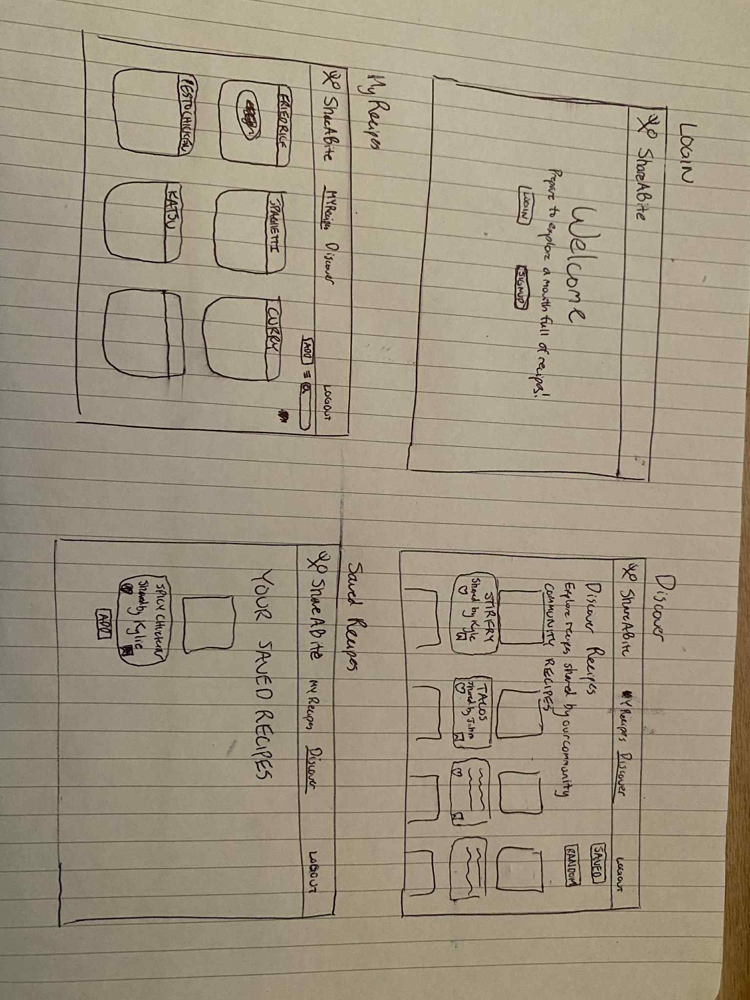
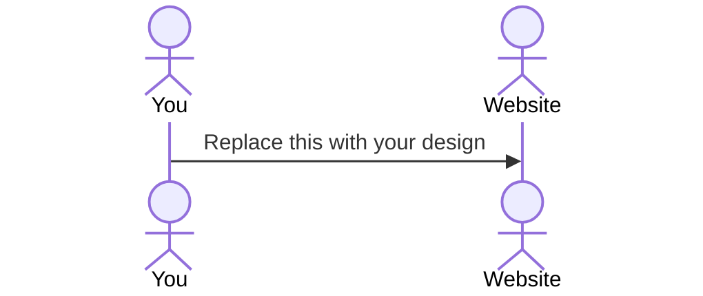

# OurTable Startup

Quick change to README.md for first assignment

[My Notes](notes.md)

A brief description of the application here. Lorem ipsum dolor sit amet, consectetur adipiscing elit, sed do eiusmod tempor incididunt ut labore et dolore magna aliqua. Ut enim ad minim veniam, quis nostrud exercitation ullamco laboris nisi ut aliquip ex ea commodo consequat. Duis aute irure dolor in reprehenderit in voluptate velit esse cillum dolore eu fugiat nulla pariatur. Excepteur sint occaecat cupidatat non proident, sunt in culpa qui officia deserunt mollit anim id est laborum.

> [!NOTE]
>  This is a template for your startup application. You must modify this `README.md` file for each phase of your development. You only need to fill in the section for each deliverable when that deliverable is submitted in Canvas. Without completing the section for a deliverable, the TA will not know what to look for when grading your submission. Feel free to add additional information to each deliverable description, but make sure you at least have the list of rubric items and a description of what you did for each item.

> [!NOTE]
>  If you are not familiar with Markdown then you should review the [documentation](https://docs.github.com/en/get-started/writing-on-github/getting-started-with-writing-and-formatting-on-github/basic-writing-and-formatting-syntax) before continuing.

## 🚀 Specification Deliverable

> [!NOTE]
>  Fill in this sections as the submission artifact for this deliverable. You can refer to this [example](https://github.com/webprogramming260/startup-example/blob/main/README.md) for inspiration.

For this deliverable I did the following. I checked the box `[x]` and added a description for things I completed.

- [x] Proper use of Markdown
- [x] A concise and compelling elevator pitch
- [x] Description of key features
- [x] Description of how you will use each technology
- [x] One or more rough sketches of your application. Images must be embedded in this file using Markdown image references.

### Elevator pitch

How many times have you wanted to try something new but did not know where to start? Or lost a great recipe a friend sent to you through messages? ShareABite makes it easy for you to save and discover dishes for you. The recipe application allows you to add, edit and delete recipes in your online cookbook. Feel free to discover recipes shared from other users and interact with them by liking and/or saving their recipe to try later. 

### Design

### Sequence Diagram

### Key features

- Secure login over HTTPS
- Ability to Add, Edit and Delete recipes in recipe box
- View All recipes in 1 location
- Post Recipes to shared page
- Browse Recipes from all users on shared page
- Save and Like Recipes from other users
- All recipes are saved 

### Technologies

I am going to use the required technologies in the following ways.

- **HTML** - Uses correct HTML structure for application. Total of 4 HTML pages.
      1. Login/LandingPage
      2. My Recipes
      3. Discover Recipes
      4. Saved Recipes
- **CSS** - Applying styles for login, recipe cards, and other features. Use to keep a clean and modern look throughout application. Animations for various buttons throughout pages. Mobile friendly design. 
- **React** - Provides login, routes between all pages, create reusable components (Recipe card, recipe card viewer, navbar, shared recipe view card, etc.) 
- **Service** - Backend service with endpoints for:
    - login
    - Add Recipe
    - View Recipe
    - Edit Recipe
    - Delete Recipe
    - Share Recipe
    - Retrieving other Shared Recipes 
    - Like Shared Recipe
    - Save Shared Recipe
    - Integrate with TheMealDB API call to randomly discover recipes on top of shared recipes
- **DB/Login** - Store users, recipes, likes, saves. Register and login users while securely storing their credentials. Public cannot react/create/edit/share recipes until they create an account and login.
- **WebSocket** - Live updates for newly shared recipes will appear for all logged-in users. 

## 🚀 AWS deliverable

For this deliverable I did the following. I checked the box `[x]` and added a description for things I completed.

- [x] **Server deployed and accessible with custom domain name** - [My server link](https://shareabite.link/).

## 🚀 HTML deliverable

For this deliverable I did the following. I checked the box `[x]` and added a description for things I completed.

- [x] **HTML pages** - I created several HTMl pages for the funcionality of the application. What was originally 4 evolved into at least 7 pages (may need more but react should help with some funcionality)
- [x] **Proper HTML element usage** - I used HTML elements correctly throughout each page. 
- [x] **Links** - I have a functioning Navbar that links to the main pages. Individual pages connected to related pages (Ex. Recipes - Add New Recipe)
- [x] **Text** - I implemented text throughout the website as needed. Not a text dense website.
- [x] **3rd party API placeholder** - I have a page connected to Discover Recipes that will connect to an API that will return a random recipe
- [x] **Images** - I used images throughout the application for the logo and recipes.
- [x] **Login placeholder** - I have login placeholder on index.html
- [x] **DB data placeholder** - I have several placeholders for the DB data from the MyRecipes page to the saved discover recipes.
- [x] **WebSocket placeholder** - A placeholder exists on the Discover page to display shared recipes by application users.

## 🚀 CSS deliverable

For this deliverable I did the following. I checked the box `[x]` and added a description for things I completed.

- [x] **Header, footer, and main content body** - I applied styles to the header, footer and main content for each page.
- [x] **Navigation elements** - All navigation elements are the same on each page. They are styled to reflect the theme of the website. 
- [x] **Responsive to window resizing** - Each page adjusts to the screen size.
- [x] **Application elements** - Used styles on every aspect of the project. For instance, the buttons (after adjusting the bootstrap theme) follow the color scheme of the application. 
- [x] **Application text content** - Adjusted most text to be centered on the screen and interact with flex. All font matches what is found in main.css for main/body
- [x] **Application images** - I adjusted images (logo, recipes) throughout each page on this application. 

## 🚀 React part 1: Routing deliverable

For this deliverable I did the following. I checked the box `[x]` and added a description for things I completed.

- [x] **Bundled using Vite** - I succesfully bundled using Vite.
- [x] **Components** - I created page components for all the functions of my application. 
- [x] **Router** - I succesfully set up a Routing system. 

## 🚀 React part 2: Reactivity deliverable

For this deliverable I did the following. I checked the box `[x]` and added a description for things I completed.

- [x] **All functionality implemented or mocked out** - I did my best to complete this part of the deliverable.
- [x] **Hooks** - I did my best to complete this part of the deliverable.

## 🚀 Service deliverable

For this deliverable I did the following. I checked the box `[x]` and added a description for things I completed.

- [x] **Node.js/Express HTTP service** - I created an HTTP service using Node.js and Express
- [x] **Static middleware for frontend** - Using the simon example, I created static middleware for frontend.
- [x] **Calls to third party endpoints** - I call to a third party endpoint that returns a random recipe on the discover page.
- [x] **Backend service endpoints** - To keep things simple, I am mainly creating funcionality for building your own recipe DB (add, edit, delete, share) and sharing recipes with others. I would love to build out several other funcionalities like liking and saving shared recipes,  but that will be for another day! 
- [x] **Frontend calls service endpoints** - I completed calls in the frontend for services such as recipe add, edit, delete, and share. 
- [x] **Supports registration, login, logout, and restricted endpoint** - Using the simon example, I created a system that supports registration, login, logout, and restricted endpoints. 

## 🚀 DB deliverable

For this deliverable I did the following. I checked the box `[x]` and added a description for things I completed.

- [x] **Stores data in MongoDB** - Stores recipe data that can be used and accessed throughout the website.  
- [x] **Stores credentials in MongoDB** - User information is stored and used to filter data. 

## 🚀 WebSocket deliverable

For this deliverable I did the following. I checked the box `[x]` and added a description for things I completed.

- [x] **Backend listens for WebSocket connection** - The backend listens for WebSocket connection for Discover and myRecipes page. 
- [x] **Frontend makes WebSocket connection** - The frontend makes WebSocket connection.
- [x] **Data sent over WebSocket connection** - Recipe information is succesfully sent over connection. 
- [x] **WebSocket data displayed** - Recipes from Recipes page are succesfully shared to the Discover page with who it is from. 
- [x] **Application is fully functional** - My application should be fully functional. 
